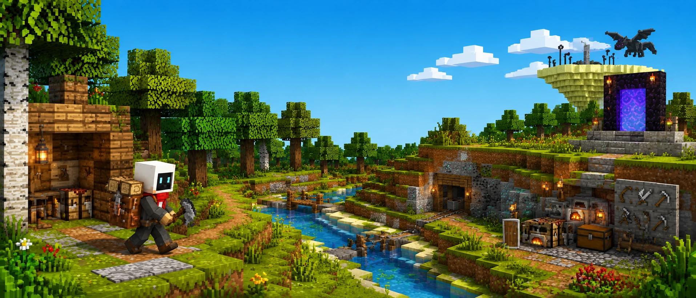
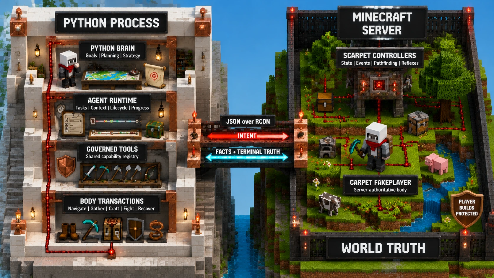
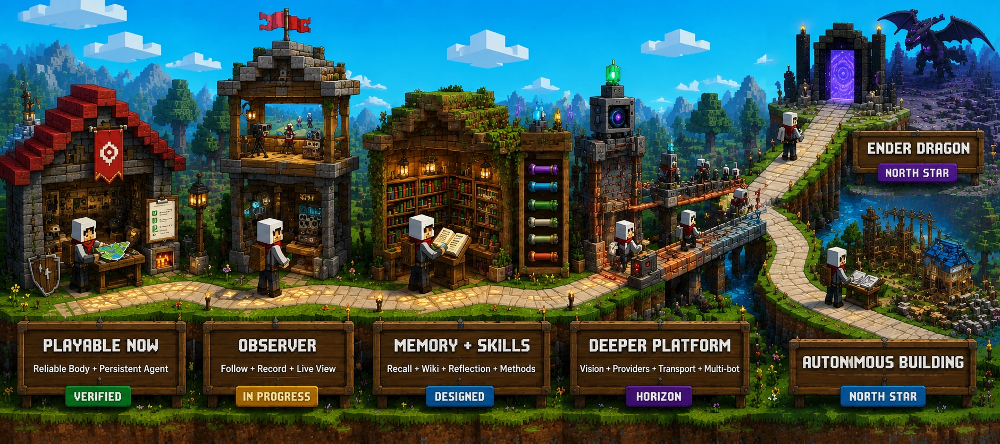

<div align="center">

# MineBot

**Ender Dragon, I will kill you.**

*A Minecraft agent with a mind that can improvise and a body that can be trusted.*




</div>

Tell MineBot what you want in ordinary language. The model chooses a strategy,
the harness keeps the thread, and a server-authoritative body does the physical
work.

> **You:** Collect 64 logs.<br>
> **MineBot:** reasons, acts, observes, recovers, and keeps going.

## Not A Script Wearing A Chatbot

MineBot puts deterministic machinery where language models are weak: physics,
precise state, long-running execution, ownership, and reflexes. It leaves goals,
trade-offs, and adaptation to the model.

The model chooses from one shared capability pool. The harness preserves task
continuity. The Body handles the grind inside one physical objective. Every
result comes back as structured world truth.

Mindcraft and mineflayer automate through a Minecraft client; Baritone is a
full-client pathfinder. MineBot keeps physics and fast reactions on the server,
then accepts success only when authoritative world state confirms it.

## Built To Finish

**Navigate. Gather. Craft. Smelt. Equip. Fight. Recover. Continue.**

The current baseline has passed real-server gates for collecting 64 logs,
tool-gated acquisition through diamond, navigation over real terrain, following,
combat, survival preemption, death recovery, restart reconciliation, and idle
wake-up. Success is measured by authoritative world and inventory changes, not
by a tool claiming it succeeded.

## One Mind. One Body. One Source Of Truth.



`openai-agents-python` runs the inner model/tool loop. MineBot owns the persistent
control plane around it: tasks, context, lifecycle, progress, and governed tools.
Python Body transactions complete physical objectives through JSON over RCON;
Scarpet reads authoritative server state and runs planning, controllers, events,
and reflexes; Carpet supplies the physical FakePlayer body.

The Brain decides **what**. The Body resolves **how**. Player-made blocks remain
protected across both planning and execution.

```text
minebot/
  brain/      context, lifecycle, progress, capability registry
  app/        persistent runtime and the single composition root
  body/       navigation, work, inventory, crafting, combat, recovery
  game/       protocol, transport, governance, server-backed Body client
  contract/   shared facts and result schemas
  camera/     optional observer supervisor and recording/live fan-out

minecraft/
  server/     Scarpet controllers and the optional Fabric bridge
  camera/     observer client and shared Java protocol

tests/        unit, live Body, and real-agent gates
```

## The Road Gets Stranger



The reliable Body and persistent agent are the foundation, not the finish line.
Next comes a real observer; then memory, Minecraft knowledge, and loadable Skills;
farther out are Vision, richer providers and transport, and many-bot worlds. The
two north stars are deliberately unreasonable: beat the Ender Dragon from
nothing, then learn to design and build in an open world.

## Wake It Up

MineBot currently targets Python 3.13 and a Minecraft 26.1.2 Fabric server with
Carpet, the MineBot Scarpet app, and local RCON enabled.

Use a disposable local world for the developer console: it spawns and resets a
FakePlayer, changes gamerules, and can seed a tiny demo patch. Install Fabric +
Carpet, enable local RCON in `server.properties`, and place the Scarpet app in
the active world's scripts directory:

```properties
enable-rcon=true
rcon.port=25576
rcon.password=test
```

```bash
mkdir -p /path/to/server/world/scripts
cp minecraft/server/scarpet/minebot.sc /path/to/server/world/scripts/
```

Start the server, then prepare MineBot:

```bash
python3.13 -m venv .venv
source .venv/bin/activate
python3 -m pip install -e .

# Anthropic, Gemini, and other LiteLLM-backed providers:
# python3 -m pip install -e ".[litellm]"

export MINEBOT_LLM_MODEL=<model>
export MINEBOT_LLM_API_KEY=<key>
# Optional for an OpenAI-compatible endpoint:
export MINEBOT_LLM_BASE_URL=<https://host/v1>

python3 -m minebot.app.console
```

Then talk to it:

```text
minebot> collect 3 dirt
minebot> follow me
minebot> what happened while I was away?
```

The local console uses `127.0.0.1:25576` with password `test`; keep that RCON
endpoint local. Existing worlds should use the non-mutating real-server
entrypoint (`python3 -m minebot.app.real_server_session --help`) instead of this
demo console.

Run the unit suite with:

```bash
python3 -m pytest tests/unit -q
```

MineBot is released under the [MIT License](LICENSE). Minecraft is a trademark
of Microsoft. MineBot is independent and is not affiliated with Mojang Studios
or Microsoft.
