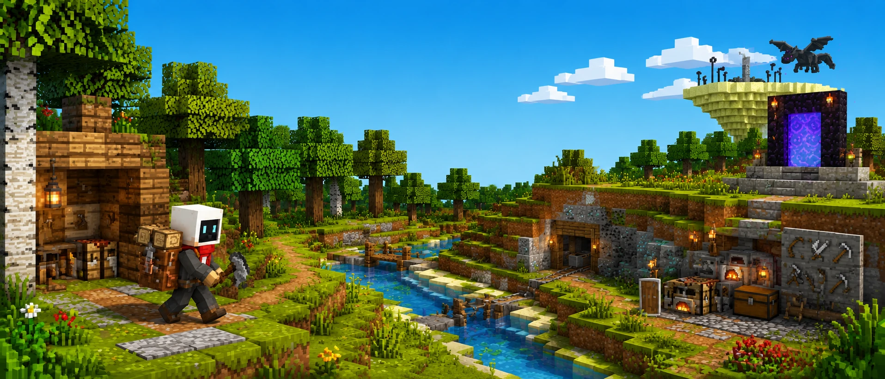
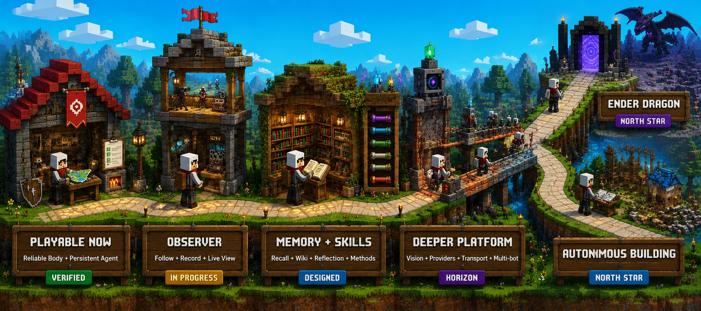

<div align="center">

# MineBot

**Ender Dragon, I will kill you.**

*A Minecraft agent with a mind that can improvise and a body that can be trusted.*




</div>

Tell MineBot what you want in ordinary language. The model chooses a strategy,
the harness keeps the thread, and a server-authoritative body does the physical
work.

> **You:** Collect 64 logs.<br>
> **MineBot:** reasons, acts, observes, recovers, and keeps going.

## Not A Script Wearing A Chatbot

MineBot puts deterministic machinery where language models are weak: physics,
precise state, long-running execution, ownership, and reflexes. It leaves goals,
trade-offs, and adaptation to the model.

The model chooses from one shared capability pool. The harness preserves task
continuity. The Body handles the grind inside one physical objective. Every
result comes back as structured world truth.

MineBot's production Body runs inside the Fabric server. Java owns indexed
perception, navigation, continuous controls, survival reactions, and structured
WebSocket transport; Carpet supplies the real FakePlayer. Scarpet/RCON remains
only as legacy regression and debug material. A real-client/Baritone path is
deferred, not part of the current production architecture. Success is accepted
only when observed server state confirms it.

## Built To Finish

**Navigate. Gather. Craft. Smelt. Equip. Fight. Recover. Continue.**

The current Java-only baseline has live evidence for natural-terrain collection,
crafting and smelting, navigation, following, combat, vertical escape, survival
preemption, death recovery, restart reconciliation, and idle wake-up. The latest
30-minute quality gate produced logs and a wooden tool chain but still failed its
long no-output and recovery criteria. This is a developer preview, not a claim
of finished open-world autonomy. Success is measured by authoritative world and
inventory changes, not by a tool claiming it succeeded.

## One Mind. One Body. One Source Of Truth.

`openai-agents-python` runs the inner model/tool loop. MineBot owns the persistent
control plane around it: tasks, context, lifecycle, progress, and governed tools.
Python Body transactions plan crafting, inventory, work, and recovery over one
provider-neutral contract. The Fabric Java Body executes physical objectives
through public `/player` controls and returns authoritative facts over WebSocket.
Every break/place/open proposal is rechecked by the shared Python governance
policy immediately before mutation.

The Brain decides **what**. The Body resolves **how**. Before physical mutation,
governance refuses protected claims and ambiguous/high-risk structure evidence.

```text
minebot/
  brain/      context, lifecycle, progress, capability registry
  app/        persistent runtime and the single composition root
  body/       navigation, work, inventory, crafting, combat, recovery
  game/       Java Body protocol/client, governance, legacy debug adapters
  contract/   shared facts and result schemas
  camera/     optional observer supervisor and recording/live fan-out

minecraft/
  server/     Fabric Java Body and archived Scarpet regression source
  camera/     observer client and shared Java protocol

tests/        unit, live Body, and real-agent gates
```

## The Road Gets Stranger



The reliable Body and persistent agent are the foundation, not the finish line.
The observer, scoped Memory, Minecraft Wiki access, and loadable Skills are now
part of that foundation. The immediate challenge is purposeful action in
natural terrain and one honest 30-minute integrated run. Farther out are Vision,
richer providers and transport, and many-bot worlds. The two north stars remain
deliberately unreasonable: beat the Ender Dragon from nothing, then learn to
design and build in an open world.

## Wake It Up

MineBot currently targets Python 3.13 and a Minecraft 26.1.2 Fabric server with
Carpet plus the MineBot Java Body mod. The Agent process talks to the Body over
WebSocket and does not need RCON credentials.

The contributor gate targets Ubuntu Linux and is developed under WSL2. Native
Windows and macOS are not currently claimed; see [support status](SUPPORT.md).

Build the Body and place the JAR in the server's `mods/` directory alongside
Fabric API and Carpet:

```bash
cd minecraft
./gradlew :server:body:build
cp server/body/build/libs/minebot-body-0.1.0.jar /path/to/server/mods/
cd ..
```

Start the server, then prepare MineBot:

```bash
python3.13 -m venv .venv
source .venv/bin/activate
python3 -m pip install -e .

# Anthropic, Gemini, and other LiteLLM-backed providers:
# python3 -m pip install -e ".[litellm]"

export MINEBOT_LLM_MODEL=<model>
export MINEBOT_LLM_API_KEY=<key>
# Optional for an OpenAI-compatible endpoint:
export MINEBOT_LLM_BASE_URL=<https://host/v1>
export MINEBOT_REAL_BOT=Bot1
export MINEBOT_JAVA_BODY_URL=ws://127.0.0.1:8767

python3 -m minebot.app.real_server_session --interactive
```

For the managed local golden-world environment, start the server reset, provider
preflight, Camera, trace/state directory, and production interactive session with
one command:

```bash
minebot-local
```

The launcher uses the local test server defaults and your existing provider
environment. For a persistent private provider profile, run `minebot-local
--init` once and fill `~/.config/minebot/runtime.env`; initialize the optional
observer once with `minebot-camera init`.

`minebot-local` resets only a loopback test server and enables Camera by
default. The launcher may use loopback RCON in its external reset step, but it
removes every RCON variable before starting the Java-only Agent child. Use
`--no-reset` to preserve the current local world or `--no-camera` on machines
without the observer stack. Remote servers use the explicit
`minebot.app.real_server_session` entrypoint and are never reset by the launcher.

Then talk to it:

```text
minebot> collect 3 dirt
minebot> follow me
minebot> what happened while I was away?
```

The old `minebot.app.console`, Scarpet app, and RCON client remain available for
legacy directed debugging only. They are not loaded by the production entrypoint.

Run the unit suite with:

```bash
python3 -m pytest tests/unit -q
```

## Make It More Reliable

Contributions are not limited to code. Reproducible failures, evaluation scenes,
traces, compatibility fixes, and clear documentation all make MineBot stronger.
Start with [Contributing](CONTRIBUTING.md), then check the current
[support matrix](SUPPORT.md). A stable failure case is a complete contribution,
even without a fix.

MineBot is released under the [MIT License](LICENSE). Minecraft is a trademark
of Microsoft. MineBot is independent and is not affiliated with Mojang Studios
or Microsoft.
